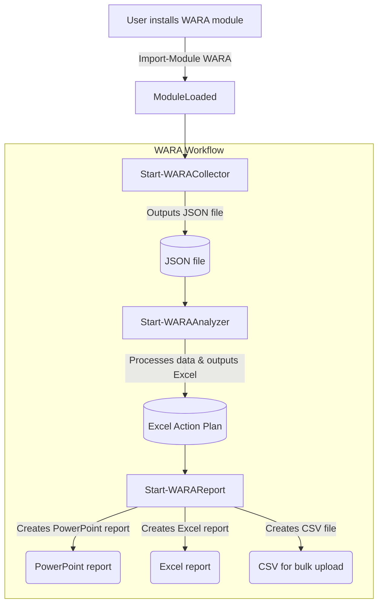

[](https://github.com/Azure/Well-Architected-Reliability-Assessment/actions/workflows/pestertests.yml)
[](https://github.com/Azure/Well-Architected-Reliability-Assessment/actions/workflows/powershell.yml)
[](https://opensource.org/licenses/MIT)

> [!NOTE]
> This repository is for the development of the WARA tooling. The up to date documentation for the module commands can be found [here](https://azure.github.io/Azure-Proactive-Resiliency-Library-v2/tools/).

# Well-Architected-Reliability-Assessment

The Well-Architected Reliability Assessment is aimed to assess an Azure workload implementation across the reliability pillar of the Microsoft Azure Well-Architected Framework. A workload is a resource or collection of resources that provide end-to-end functionality to one or multiple clients (humans or systems). An application can have multiple workloads, with multiple APIs and databases working together to deliver specific functionality.

The main goal of the Well-Architected Reliability Assessment is to provide an in-depth and comprehensive end-to-end Architecture and Resources review of an existing Workload to identify critical reliability, resiliency, availability, and recovery risks to the scoped workload on Azure.

This repository holds scripts and automation built for the Well-Architected Reliability Assessment and is currently under development.

## Table of Contents

- [Patch Notes](#patch-notes)
- [Getting Started](#getting-started)
  - [Quick Workflow Example](#quick-workflow-example)
- [Documentation](#documentation)
- [Requirements](#requirements)
- [Quick Starts](#quick-starts)
  - [Start-WARACollector](#start-waracollector)
  - [Start-WARAAnalyzer](#start-waraanalyzer)
  - [Start-WARAReport](#start-warareport)
- [CI/CD Pipeline](#cicd-pipeline)
  - [GitHub Actions](#github-actions)
  - [Azure DevOps](#azure-devops)
- [Project Structure](#project-structure)
- [Deployment Guide](DEPLOYMENT.md)
- [Documentation](docs/README.md)
- [Architecture](docs/architecture.md)
- [Glossary](docs/glossary.md)
- [Maintenance Runbooks](runbooks/README.md)
- [Contribution Guide](CONTRIBUTING.md)
- [Code of Conduct](CODE_OF_CONDUCT.md)
- [Security](SECURITY.md)
- [License](LICENSE)
- [Modules](#modules)

## Getting Started

### Patch Notes

See [Releases](https://github.com/Azure/Well-Architected-Reliability-Assessment/releases) for the latest patch notes.

### WARA Module Flow Architecture



### Quick Workflow Examples

#### Single Subscription Assessment

```PowerShell
# Install and import the WARA module
Install-Module WARA -Force -AllowClobber
Import-Module WARA

# Start the WARA collector for a single subscription
Start-WARACollector -TenantID "00000000-0000-0000-0000-000000000000" -SubscriptionIds "/subscriptions/00000000-0000-0000-0000-000000000000"

# Process the collected data
$jsonFile = Get-ChildItem -Path . -Filter "WARA_File_*.json" | Sort-Object LastWriteTime -Descending | Select-Object -First 1
Start-WARAAnalyzer -JSONFile $jsonFile.FullName

# Generate reports (requires Windows with PowerPoint)
$excelFile = Get-ChildItem -Path . -Filter "Expert-Analysis-*.xlsx" | Sort-Object LastWriteTime -Descending | Select-Object -First 1
Start-WARAReport -ExpertAnalysisFile $excelFile.FullName
```

#### Tenant-Wide Assessment

**Local Execution**

```PowerShell
# Install and import the required modules
Install-Module Az.Accounts, Az.Resources -Force -AllowClobber
Import-Module $PSScriptRoot\src\modules\wara -Force

# Run the tenant-wide assessment
.\scripts\Invoke-WARATenantAssessment.ps1 -ConfigFile .\wara-tenant-config.json

# The script will process all matching subscriptions and generate a summary report
```

**Pipeline Integration**

You can also run the tenant assessment as part of your CI/CD pipeline. Here's an example for Azure DevOps:

```yaml
- task: AzurePowerShell@5
  displayName: 'Run WARA Tenant Assessment'
  inputs:
    azureSubscription: 'your-azure-connection'
    ScriptType: 'FilePath'
    ScriptPath: '$(Build.SourcesDirectory)/scripts/Invoke-WARATenantAssessment.ps1'
    ScriptArguments: '-ConfigFile $(Build.SourcesDirectory)/wara-tenant-config.json'
    azurePowerShellVersion: 'LatestVersion'
    pwsh: true
```

Or for GitHub Actions:

```yaml
- name: Run WARA Tenant Assessment
  shell: pwsh
  run: |
    .\scripts\Invoke-WARATenantAssessment.ps1 -ConfigFile .\wara-tenant-config.json
```

For more details on configuration options and pipeline setup, see the [WARA Assessment Guide](WARA-ASSESSMENT-GUIDE.md).
```

## Requirements

> [!IMPORTANT]
> These are the requirements for the collector. Requirements for all commands can be found [here](https://azure.github.io/Azure-Proactive-Resiliency-Library-v2/tools/) in the tools section of the Azure Proactive Resiliency Library.

- [PowerShell 7.4](https://learn.microsoft.com/powershell/scripting/install/installing-powershell)
- Azure PowerShell Module
  - If you don't have the Azure PowerShell module installed, you can install it by running the following command:

    ```powershell
    Install-Module -Name Az
     ```

  - If you have the Azure PowerShell module installed, you can update it by running the following command:

    ```powershell
    Update-Module -Name Az
    ```

- Az.Accounts PowerShell Module 3.0 or later
  - If you don't have the Az.Accounts module installed, you can install it by running the following command:

    ```powershell
    Install-Module -Name Az.Accounts
    ```

  - If you have the Az.Accounts module installed, you can update it by running the following command:

    ```powershell
    Update-Module -Name Az.Accounts
    ```

- Az.ResourceGraph PowerShell Module 1.0 or later
  - If you don't have the Az.ResourceGraph module installed, you can install it by running the following command:

    ```powershell
    Install-Module -Name Az.ResourceGraph
    ```

  - If you have the Az.ResourceGraph module installed, you can update it by running the following command:

    ```powershell
    Update-Module -Name Az.ResourceGraph
    ```

## Quick Starts

### Start-WARACollector

These instructions are the same for any platform that supports PowerShell. The following instructions have been tested on Azure Cloud Shell, Windows, and Linux.

You can review all of the parameters on the Start-WARACollector [here](docs/wara/Start-WARACollector.md).

> [!NOTE]
> Whatever directory you run the `Start-WARACollector` cmdlet in, the Excel file will be created in that directory. For example: if you run the `Start-WARACollector` cmdlet in the `C:\Temp` directory, the Excel file will be created in the `C:\Temp` directory.

1. Install the WARA module from the PowerShell Gallery.

```powershell
# Installs the WARA module from the PowerShell Gallery.
Install-Module WARA
```

2. Import the WARA module.

```powershell
# Import the WARA module.
Import-Module WARA
```

3. Start the WARA collector. (Replace these values with your own)

```powershell
# Start the WARA collector.
Start-WARACollector -TenantID "00000000-0000-0000-0000-000000000000" -SubscriptionIds "/subscriptions/00000000-0000-0000-0000-000000000000"
```

### Examples

#### Run the collector against a specific subscription

```PowerShell
Start-WARACollector -TenantID "00000000-0000-0000-0000-000000000000" -SubscriptionIds "/subscriptions/00000000-0000-0000-0000-000000000000"
```

#### Run the collector against a multiple specific subscriptions

```PowerShell
Start-WARACollector -TenantID "00000000-0000-0000-0000-000000000000" -SubscriptionIds @("/subscriptions/00000000-0000-0000-0000-000000000000","/subscriptions/00000000-0000-0000-0000-000000000001")
```

#### Run the collector against a specific subscription and resource group

```PowerShell
Start-WARACollector -TenantID "00000000-0000-0000-0000-000000000000" -SubscriptionIds "/subscriptions/00000000-0000-0000-0000-000000000000" -ResourceGroups "/subscriptions/00000000-0000-0000-0000-000000000000/resourceGroups/RG-001"
```

#### Run the collector against a specific subscription and resource group and filtering by tag key/values

```PowerShell
Start-WARACollector -TenantID "00000000-0000-0000-0000-000000000000" -SubscriptionIds "/subscriptions/00000000-0000-0000-0000-000000000000" -ResourceGroups "/subscriptions/00000000-0000-0000-0000-000000000000/resourceGroups/RG-001" -Tags "Env||Environment!~Dev||QA" -AVD -SAP -HPC
```

#### Run the collector against a specific subscription and resource group, filtering by tag key/values and using the specialized resource types (AVD, SAP, HPC, AVS)

```PowerShell
Start-WARACollector -TenantID "00000000-0000-0000-0000-000000000000" -SubscriptionIds "/subscriptions/00000000-0000-0000-0000-000000000000" -ResourceGroups "/subscriptions/00000000-0000-0000-0000-000000000000/resourceGroups/RG-001" -Tags "Env||Environment!~Dev||QA" -AVD -SAP -HPC
```

#### Run the collector using a configuration file

```PowerShell
Start-WARACollector -ConfigFile "C:\path\to\config.txt"
```

#### Run the collector using a configuration file and using the specialized resource types (AVD, SAP, HPC, AVS)

```PowerShell
Start-WARACollector -ConfigFile "C:\path\to\config.txt" -SAP -AVD
```

### Start-WARAAnalyzer

The `Start-WARAAnalyzer` cmdlet is used to analyze the collected data and generate the core WARA Action Plan Excel file.

> [!NOTE]
> Whatever directory you run the `Start-WARAAnalyzer` cmdlet in, the Excel file will be created in that directory. For example: if you run the `Start-WARAAnalyzer` cmdlet in the `C:\Temp` directory, the Excel file will be created in the `C:\Temp` directory.

You can review all of the parameters of Start-WARAAnalyzer [here](docs/wara/Start-WARAAnalyzer.md).

#### Examples

##### Run the analyzer against a specific JSON file

```PowerShell
Start-WARAAnalyzer -JSONFile 'C:\WARA\WARA_File_2024-04-01_10_01.json'
```

### Start-WARAReport

The `Start-WARAReport` cmdlet is used to generate the WARA reports.

> [!NOTE]
> Whatever directory you run the `Start-WARAReport` cmdlet in, the Excel and PowerPoint files will be created in that directory. For example: if you run the `Start-WARAReport` cmdlet in the `C:\Temp` directory, the Excel and PowerPoint files will be created in the `C:\Temp` directory.

You can review all of the parameters of Start-WARAReport [here](docs/wara/Start-WARAReport.md).
> [!WARNING]
> Make sure to close all instances of **Microsoft Excel** and **Microsoft PowerPoint** prior to running `Start-WARAReport`
#### Examples

##### Create the Excel and PowerPoint reports from the Action Plan Excel output

```PowerShell
Start-WARAReport -ExpertAnalysisFile 'C:\WARA\Expert-Analysis-v1-2025-02-04-11-14.xlsx'
```

## CI/CD Pipeline

The project includes CI/CD pipelines for both GitHub Actions and Azure DevOps to automate testing, building, and deployment of the WARA module.

### GitHub Actions

The GitHub Actions workflow is defined in `.github/workflows/ci-cd.yml` and includes the following jobs:

1. **Test**: Runs Pester tests and PSScriptAnalyzer on Ubuntu
2. **Build**: Builds the module on Windows
3. **Deploy**: Publishes the module to PowerShell Gallery (runs on release)

#### GitHub Secrets

To use the GitHub Actions workflow, you need to set up the following secrets:

- `NUGET_API_KEY`: Your PowerShell Gallery API key for publishing packages

### Azure DevOps

The Azure DevOps pipeline is defined in `azure-pipelines.yml` and includes the following stages:

1. **Test**: Runs Pester tests and PSScriptAnalyzer
2. **Build**: Builds the module
3. **Deploy**: Publishes the module to PowerShell Gallery (runs on main branch)

#### Azure DevOps Variables

To use the Azure DevOps pipeline, you need to set up the following variables in your pipeline:

- `NUGET_API_KEY`: Your PowerShell Gallery API key for publishing packages

## Project Structure

This repository is meant to be used for the development of the Well-Architected Reliability Assessment automation. This project uses outputs from the Azure Well-Architected Framework and Azure Advisor to provide insights into the reliability of an Azure workload.

## Modules

- [🔍wara](docs/wara/wara.md)
- [🎗️advisor](docs/advisor/advisor.md)
- [📦collector](docs/collector/collector.md)
- [🌩️outage](docs/outage/outage.md)
- [🏖️retirement](docs/retirement/retirement.md)
- [🔬scope](docs/scope/scope.md)
- [🏥servicehealth](docs/servicehealth/servicehealth.md)
- [🩹support](docs/support/support.md)
- [🔧utils](docs/utils/utils.md)
