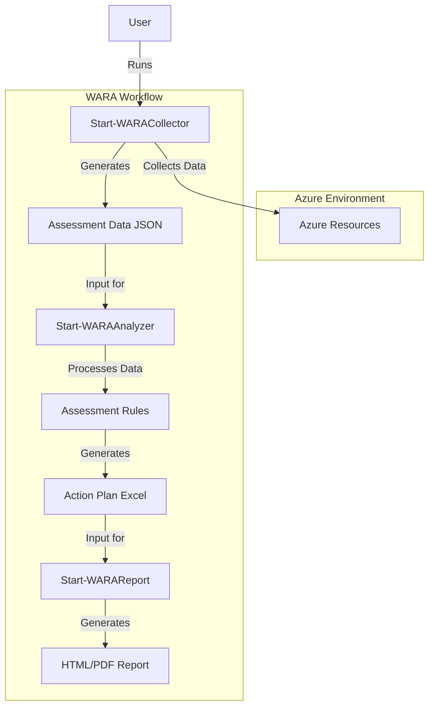
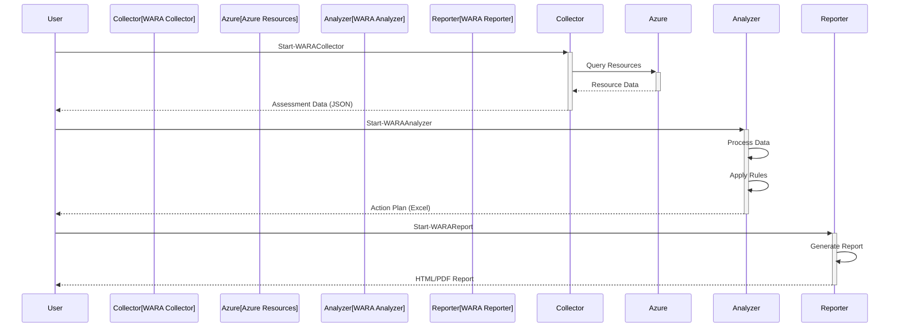
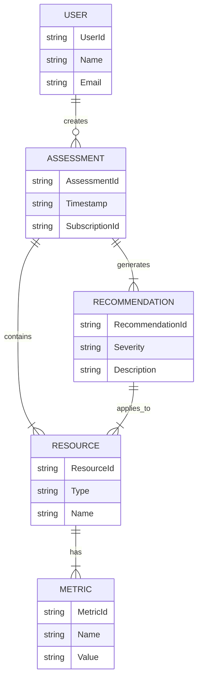
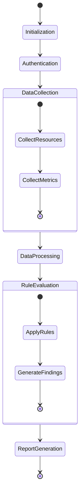
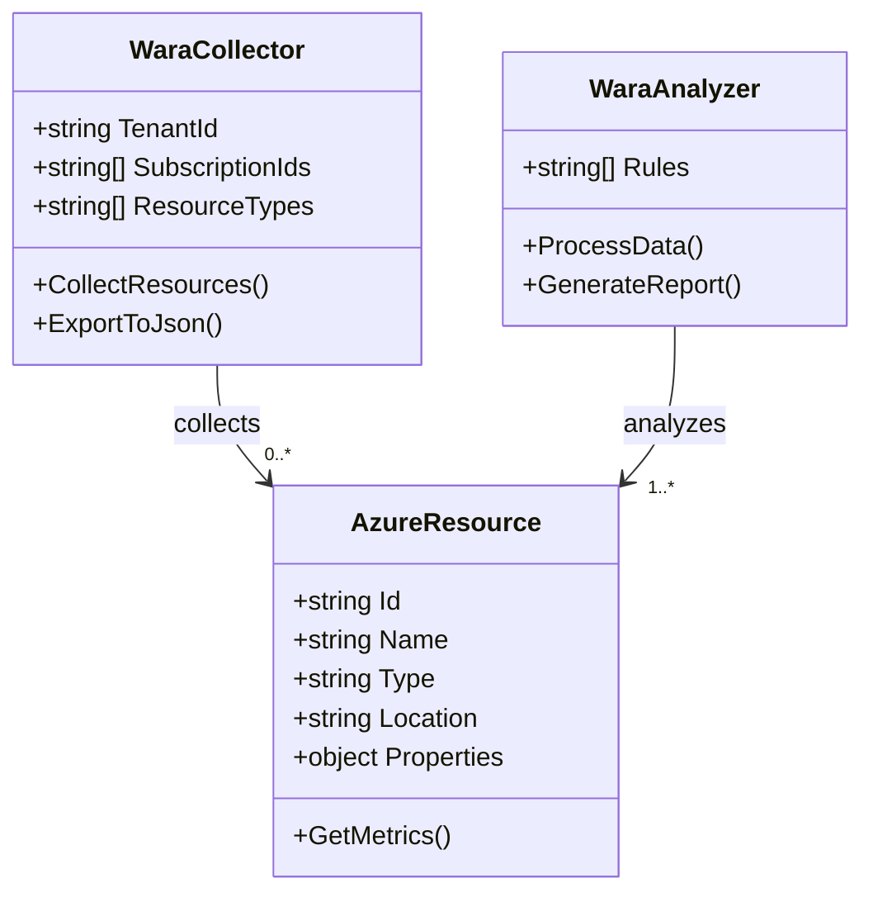
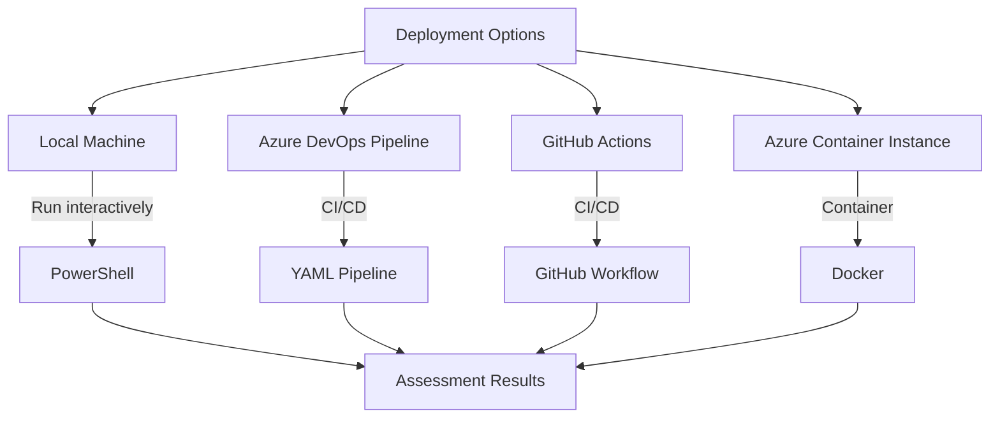

# WARA Architecture

## High-Level Architecture

## Data Flow

## Component Relationships

## Assessment Process Flow

## Azure Resource Collection

## Deployment Options

## Legend

- **Solid arrows** indicate direct data flow
- **Dashed arrows** indicate optional or conditional flow
- **Rectangles** represent processes or components
- **Ovals** represent data stores or outputs
- **Diamonds** represent decision points

For more detailed diagrams or specific aspects of the architecture, please refer to the respective documentation sections.
